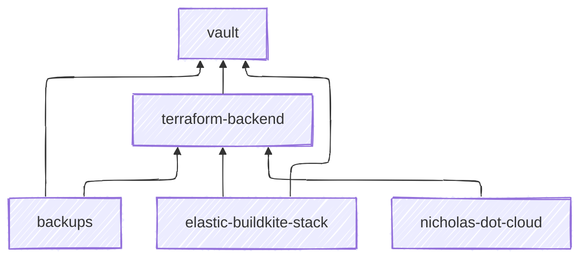

# hosting

Infrastructure, playbooks and configuration for self-hosted services I run.

## Pipelines

I automate some maintenance tasks with Buildkite.

- [`backup-vault`](https://buildkite.com/nchlswhttkr/backup-vault) - Backs up my Hashicorp Vault instance

## Infrastructure

I have a number of Terraform projects that don't belong to any particular project repositories, so I keep them here.

| Project                   | Description                                                                  |
| ------------------------- | ---------------------------------------------------------------------------- |
| `backups`                 | Automating backups of my self-hosted services                                |
| `elastic-buildkite-stack` | Autoscaling Buildkite agents, plus secrets needed by my Buildkite pipelines  |
| `nicholas-dot-cloud`      | Infrastructure related to my personal website                                |
| `terraform-backend`       | An AWS backend for all my other Terraform projects to use                    |
| `vault`                   | Backend and policy configuration for my self-hosted Hashicorp Vault instance |

<!-- https://github.com/nchlswhttkr/hosting/tree/9c2a80cc908db6f109b2ed3269e022d77eb3b736/infrastructure/nicholas-dot-cloud-preview -->

Each project is deployed by its own `Makefile`.

```sh
make -C infrastructure/terraform-backend
```

Be mindful that there are some dependencies between Terraform projects (namely the `terraform-backend`).



## Self-hosted Deployments

I self-host a number of personal projects and services, and predominantly manage these with Ansible.

Once again each project has its own `Makefile`, but there a little bit of general setup required for Ansible too.

```sh
make -C deploy

make -C deploy/blog
make -C deploy/buildkite-uploader
make -C deploy/vault
```

### Setting up new hosts

There's a couple of assumed tools and setup needed before a new host is good to go with Ansible.

- Install [Tailscale](https://tailscale.com/kb/1031/install-linux/) and add to your Tailnet
- Install [Certbot](https://certbot.eff.org/instructions)
  - Installing Certbot will require [Snap](https://snapcraft.io/docs/installing-snap-on-raspbian)
  - For now, use [the Cloudflare plugin](https://certbot-dns-cloudflare.readthedocs.io/en/stable/)

TLS certificate provisioning and automatic renewal will be set up as part of the `nginx` role.
